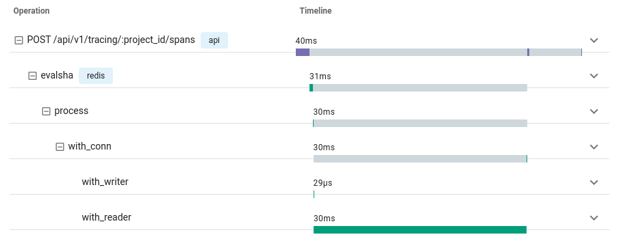

# Tracing

go-redis supports tracing out-of-the-box using [OpenTelemetry](https://opentelemetry.io/) API. To
enable commands instrumentation, use the following code:

```go
import (
    "github.com/go-redis/redis/v8"
    "github.com/go-redis/redis/extra/redisotel/v8"
)

rdb := redis.NewClient(&redis.Options{...})

rdb.AddHook(redisotel.NewTracingHook())
```

For Redis Cluster and Ring you should instrument each node separately:

```go
rdb := redis.NewClusterClient(&redis.ClusterOptions{
    // ...

    NewClient: func(opt *redis.Options) *redis.Client {
        node := redis.NewClient(opt)
        node.AddHook(redisotel.NewTracingHook())
        return node
    },
})

rdb.AddHook(redisotel.NewTracingHook())
```

This is how a span looks at Uptrace.dev which is an OpenTelemetry backend that supports
[distributed traces, logs, and errors](https://uptrace.dev/explore/1/groups/?system=db%3Aredis&utm_source=redis&utm_campaign=redis-tracing).


